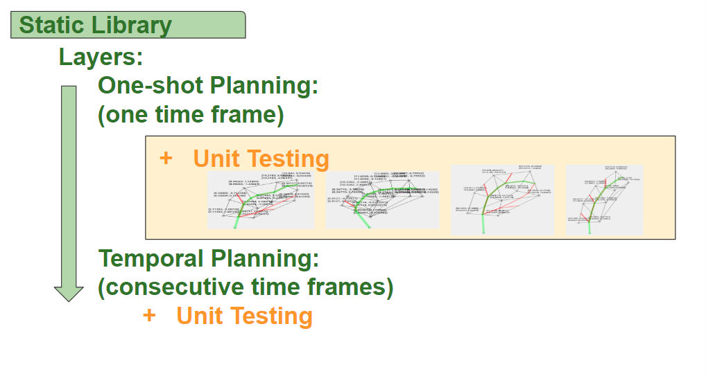
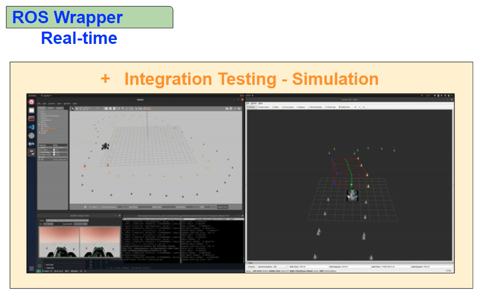
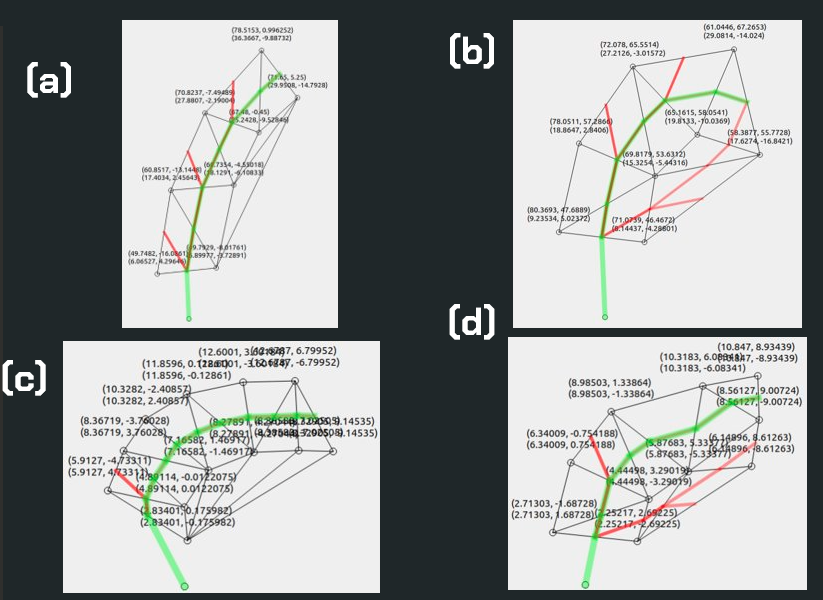

# Delaunay Triangulation-Based Path Planner
This repository contains the implementation of a path planner based on Delaunay Triangulation, designed for the specific autonomous navigation task in the F-SAE competition. 

The planner is divided into three main components:

- `Static Geometry Planner`
- `Temporal Planner`
- `ROS node for real-time planning`

The path planner leverages the computational efficiency and robustness of Delaunay Triangulation for generating the center-line path of the track dictated by cones.

  

# Architecture 
## Package Structure
- `include`: header files
- `src`: implementation files
- `test`: unit tests
- `plotting`: plot the path from a set of cones, visualising the planner in a single frame
- `testing-code`: scrath directory

## Inheritance hierarchy
`Static Geometry Planner` <--- `Temporal Planner` <--- `Real-time ROS Wrapper`

## Design intention for testing

<b>Onboarding Presentation Slides</b>

  
  

### Different Versions of the Planner
Currently there are two versions. Guide to explore the codebase: tracing back from the two ROS Wrappers.
- `DTRealTimeROSWrapper` ---> `DTRealTime` ---> `DTriangPlanner`
- `DTriangPlannerColorLightROSWrapper` ---> `DTriangPlannerColorLight`

# Unit Testing and Plotting
The package provides testing utility such as unit tests and the plotting module. 
- The unit testing module covers the Static Geometry Planner and Temporal Planner.
- Plotting (Qt5) helps for visual assessment of the generated paths.

  

# Usage 
Launching the ROS node:
`roslaunch d_triang utsma_path_planner`

# Dependencies
- `ROS Noetic` For real-time planning and integration with robotic systems.
- `CGAL` Computational Geometry Algorithms Library, used for Delaunay Triangulation and geometric computations.
- `YAML-CPP` For configuration and parameter management. 
- `Qt5 (Widgets)` Required for graphical user interface applications, if any within the project.
- `GMP` (GNU Multiple Precision Arithmetic Library) and `MPFR` (Multiple Precision Floating-Point Reliable Library): For high-precision arithmetic operations, often utilized in tandem with CGAL for precise geometric computations.
- `GTest` (Google Test): Google's C++ test framework, used for unit testing of the project components.

# Notes
- [Notes](doc/misc_note.md) on the functionality of the CGAL Delaunay Triangualtion

# Reference 
- The package is developed according to the path planner from AMZ. See: [AMZ Driverless: The Full Autonomous Racing System](doc/pdf)
- The simplified version of the planner can be explained in the blogpost from MathWorks: [Path Planning for Formula Student Driverless Cars Using Delaunay Triangulation](https://blogs.mathworks.com/student-lounge/2022/10/03/path-planning-for-formula-student-driverless-cars-using-delaunay-triangulation/) 
